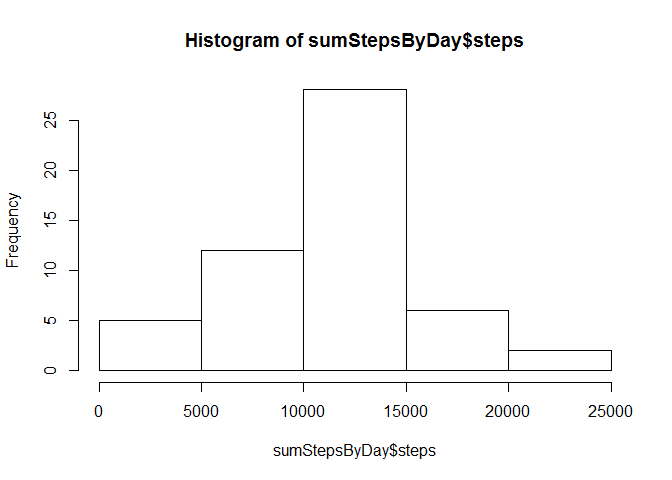
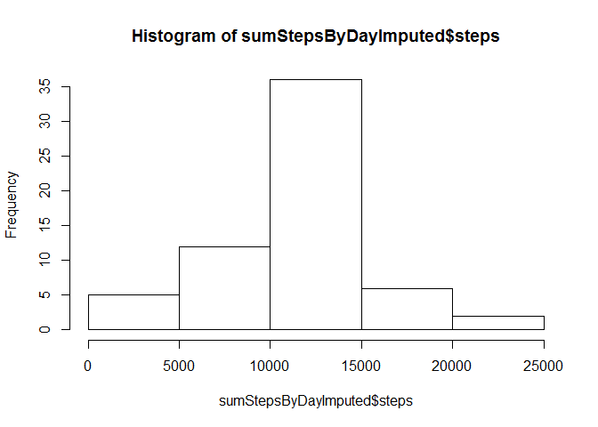
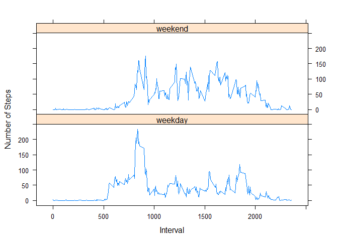

# Reproducible Research: Peer Assessment 1


## Loading and preprocessing the data

The data set for this analysis can be downloaded here:  [Activity monitoring data](https://d396qusza40orc.cloudfront.net/repdata%2Fdata%2Factivity.zip) [52K]

Assuming this dataset has been downloaded, unzipped, and that we are in the working directory, we will read in the data using read.csv.

We will also convert the date to a true R date.


```r
# Read the data
activity<-read.csv("activity.csv")

# Convert the date to a date
activity$date=as.Date(activity$date)
```


## What is mean total number of steps taken per day?

To calculate the mean steps per day, we will group by day and sum the steps over each day using the aggregate function and put the results into a new data.frame called sumStepsbyDay.


```r
# Sum the steps by day
sumStepsByDay <- aggregate(steps~date,activity,sum)

# Show a histogram
hist(sumStepsByDay$steps)
```

 

```r
# Calculate the mean
mean(sumStepsByDay$steps)
```

```
## [1] 10766.19
```

```r
# Calculate the median
median(sumStepsByDay$steps)
```

```
## [1] 10765
```

## What is the average daily activity pattern?

To get a sense of the daily activity pattern, we will graph the mean steps by interval.


```r
# Get the mean number of steps by interval
meanStepsByInterval<-aggregate(steps~interval,activity,mean)

# Plot it
plot(meanStepsByInterval,type="l")
```

 

```r
# Find out which interval has the maximum average steps
interval_max <- meanStepsByInterval[which.max(meanStepsByInterval$steps),]
```


Interval 835 has the maximum average steps, which is 206.1698113

## Imputing missing values

First, determine if there are rows with missing (NA) values.


```r
incRows<-nrow(subset(activity,complete.cases(activity)==FALSE))
```

There are 2304 rows with missing (NA) values.  We will fill these in with the mean for that interval across all days in the dataset.

Calculate the mean steps by interval and replace NA values with the mean for that interval.  We will build a data.table from the original data.frame in order to add a column that calculates the mean by interval (interval\_mean).  Then we will update the NA values to equal the interval_mean.


```r
library(data.table)

activityDT<-data.table(activity)

# Calculate the mean by interval
activityDT[,interval_mean:=mean(steps,na.rm = TRUE),by=interval]

# Update steps to be the interval_mean where steps is NA
activityDT[is.na(steps),steps:=as.integer(round(interval_mean))]

# Sum the steps by day from the imputed dataset
sumStepsByDayImputed <- aggregate(steps~date,activityDT,sum)

# Show a histogram
hist(sumStepsByDayImputed$steps)
```

 

```r
# Calculate the mean
mean(sumStepsByDayImputed$steps)
```

```
## [1] 10765.64
```

```r
# Calculate the median
median(sumStepsByDayImputed$steps)
```

```
## [1] 10762
```

Compare the mean and median from the original calculation to the new calcution which imputed the NA values:

Mean from raw values: 10766.1886792453  
Mean from imputed values: 10765.6393442623 

Median from raw values: 10765  
Median from imputed values: 10762 

The imputed dataset resulted in slightly lower values for mean and median.

## Are there differences in activity patterns between weekdays and weekends?

Add a column to the dataset to identify the days as either a weekend or weekday using the weekdays() function.


```r
# Add a column to determine if the day is a weekend
activity$daytype=ifelse(
        weekdays(activity$date) %in% c("Saturday","Sunday"),
        "weekend",
        "weekday")

# Convert the daytype column to a factor
activity$daytype=as.factor(activity$daytype)

# plot it using lattice
library(lattice)

xyplot(steps~interval|daytype,
       data=aggregate(steps~interval+daytype,activity,mean),
       layout=c(1,2), 
       type="l",
       xlab="Interval",
       ylab="Number of Steps")
```

 
